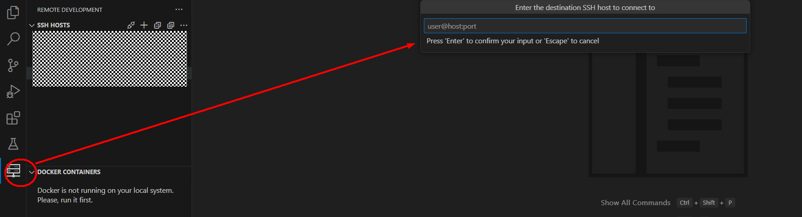
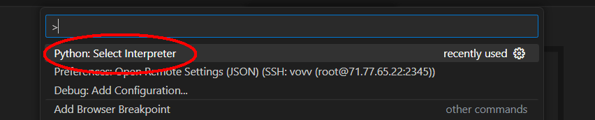
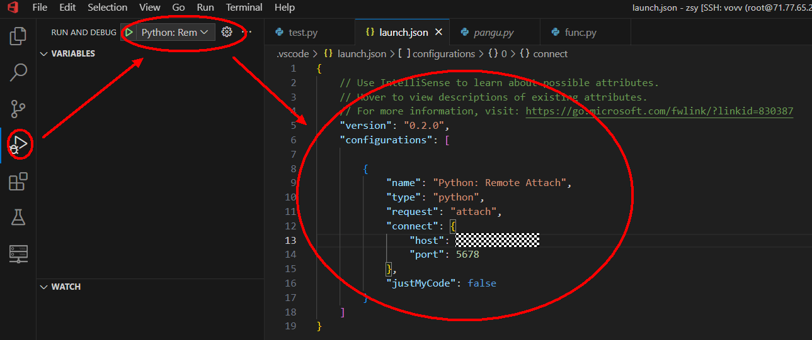
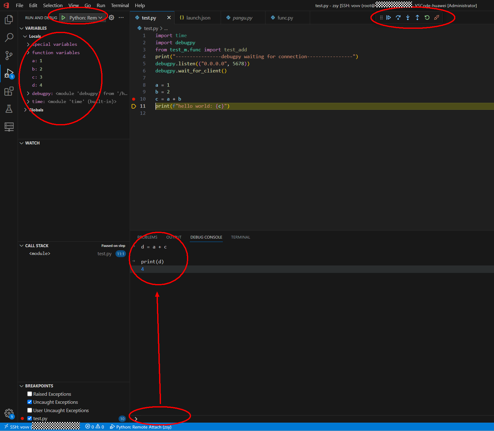

# 使用debugpy远程attach调试python进程（vscode版）
本文介绍基于vscode以attach方式使用debugpy在本地调试远程python进程，虚机和docker容器均可使用，但需要对远程的代码/脚本进行一些简单的侵入修改。Attach的好处很多，相比pycharm只能使用本地debug server让远程作为客户端来连接本地，attach的方式更加灵活。

## 前置要求
工具：vscode
远程所需额外的python模块：debugpy
远程需要安装的vscode extension：remotedev，python，pylance

## vscode远程连接服务器
首先使用ssh连接到我们的远程服务器，从而我们可以在workspace打开远程工程目录


在服务器上执行
```bash
which python
```
找到当前环境下的python解释器路径，然后回到vscode，`ctrl+shift+p`打开设置，选择`Python: Select Interpreter`，把环境上的python解释器路径填入。

解释器填入后重启一下窗口，然后可以发现代码已经可以跳转，包括你当前环境的site-packages都可以直接跳转看源码了。

## 使用debugpy远程调试
基于debugpy的使用，你有两种方式去修改服务器上的代码：
1. 直接修改代码
2. 修改启动python进程的脚本，加入一些相关参数

debugpy的使用可以基于代码or命令行，若在代码中使用范例如下，提供一个监听端口即可使用：
```python
import debugpy
print("----------------debugpy waiting for connection----------------")
debugpy.listen(("0.0.0.0", 5678))
debugpy.wait_for_client()

# ...your code below

```
或者也可以使用命令行，在你需要执行的python指令中加入debugpy参数：
```bash
python -m debugpy --listen 0.0.0.0:5678 --wait-for-client your_python_file.py
```
在启动你的python进程后，打开vscode，配置一下Run&Debug配置：


```json
{
    // 如果你使用remote debug vscode提供的launch模板，可能会带有一个pathMappings的选项，需要直接删除它否则无法调试
    "version": "0.2.0",
    "configurations": [

        {
            "name": "Python: Remote Attach",
            "type": "python",
            "request": "attach",
            "connect": {
                "host": "xxxxxxxxxx",
                "port": 5678
            },
            // "pathMappings": [
            //     {
            //         "localRoot": "${workspaceFolder}",
            //         "remoteRoot": "."
            //     }
            // ],
            "justMyCode": false // 这个配置使得你在调试时也可以访问环境中你的项目所依赖的其他package的代码
        }
    ]
}
```
然后启动debug任务，启动后可以查看当前变量表，调用堆栈，单步调试，交互式的变量evaluation，如下图所示：
