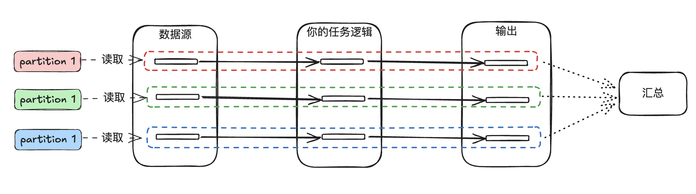

# [WIP] 设计一个分布式计算引擎

纯娱乐。

## Why you need to do this

你是soulboy，现在是200x年，同时你是一名数据科学家，你最近总是为你的某些数据分析任务执行不够快而烦恼，有些时候数据源有点大，跑的时间很久，你无所事事，摸鱼都摸腻了。有一天你幡然醒悟，不想浪费时间，想做更多伟大的事，于是决定自己搞一个软件去解决**数据量一大跑的太慢了**这个问题。

## chapter 1：重复的简单事情，加速做...

你重新看了看你写的代码，发现做了这么几个事：

1. 读数据
2. 把数据里的每一个字符从小写变成大写
3. 打印出来

你发现任务的表达还是非常简单的，你尝试进行一些抽象的提取：

你发现其实每一条数据，从开始到输出，似乎都经历了一样的事情，就是跑了一下你的任务逻辑，然后输出。因此你有了第一个想法，你尝试拉高执行你任务逻辑的线程数，每来一条数据，原本分给一个线程，你现在分给三个线程：

你发现诶，真的快了，但是很快你发现了问题，你读数据和最后输出的部分依旧似乎还是原来的速度，你马上想出了新的对策，我给这俩玩意也配仨线程不完事了！于是你的程序变成了这样：

你发现又快了一点，但你发现这个架构好像有点冗余了，因为你发现你开了九个线程，但你的想法完全可以类比为数据源的第一条线程把数据读上来给任务逻辑的第一条线程再给输出的第一条线程，假设数据源的三条线程在读，那后面的线程在它们读的时候完全是空闲状态，完全没这个必要啊，你把它们仨搞再同一个线程里，然后依次处理读，计算然后输出，这样既少开了线程，还增加同一条线程见数据的本地性，于是你把程序变成了：

本来九个线程，现在三个线程，好像速度也差不多甚至更快了。这时你又发现数据的读取似乎需要一点管理，不然三个线程彼此之间咋知道对方读到哪了？我应该读哪条数据？聪明的你马上想到，把数据源分成不同区域不就好了，互相不干扰，反正做的事情都是一样的，于是你给数据进行了三个分区（Partition），它可以依照一定的逻辑去执行分区，比如第一条线程读0-10000行，第二条线程读10001-20000以此类推，然后让三条线程分别依次处理三个分区的数据，这就好像三个线程各自在执行各自的任务（Task），**一个Task处理一个Partition的数据**，互不干扰：

你沾沾自喜，觉得自己很牛逼，给你的同事们看，结果你的同事问了你一个直击灵魂的问题：**如果你的结果依赖整个数据集怎么办**，比如你们的另外一个业务，是统计数据的行数，这样你分开来执行Task，你也只能知道单个分区的行数啊！你马上想到一个办法，在多个Task的执行的最后加个汇总逻辑，做个汇总处理就可以了！如果任务不需要做汇总，你定一个空的汇总逻辑就可以了。

解决了这些问题，于是你有了第一版的数据计算引擎，你通过**加大线程数，压榨CPU**，大大加快了程序的运行效率。

## Chapter 2：别叫了，给你找个兄弟

自从你发明了这个程序，它获得了一众好评，你们的业务也蒸蒸日上，需要处理的数据量越来越大。每次你想进一步加速你的计算引擎，便会干高文件分区数，提高Task的数量来加速，但你慢慢发现CPU开始罢工了，你的电脑仿佛在说，妈的，本来我一个人活干的好好的，自从你搞了这个什么破引擎，我每天一个人要干那么多个人的活，让我干10个人的就算了，现在让我干100个，哥们不干了！

你开始想办法了，这样确实不行，那我也给你找个同事，你把手里活分点出去就好了！于是你又找了一台机子，开始拓展的计算引擎。但你发现加台机子需要考虑一些事情：

1. 你的数据源存在哪？两台机子都要计算，你的数据是放在节点1，还是节点2？
2. 对于一个数据源，如果你的程序想尝试不同的Task数，节点1和节点2分别要处理多少分区的数据呢？
3. 最后两台机子上执行的Task如何汇总？

于是你设计了**第一个架构**，你给两台机子定了一个皇上（Master）一个奴才（Slave），皇上负责统筹全局，奴才只负责听老大的干活就完事了，于是你尝试回答上面三个问题：

1. 数据源放在Master节点。
2. 程序从Master启动，用户会指定Task的数量，于是在Master节点先对数据进行分区，然后把需要Slave节点处理的分区通过网络传输给Slave节点去计算。
3. 所有Task把分区计算完后，Slave统一再网络传回给Master节点汇总处理。

结果你发现一个问题，每次Master把要处理的数据传给Slave节点真的很慢，于是你想了一个办法，我直接在Slave节点上也存一份数据源，然后Master只要把Slave需要处理数据源的哪一部分告诉Slave就行了，从传数据变成了传一个数据源的范围值，Slave只要去读它需要读的部分就可以了，虽然这样占用了Slave的磁盘，但是你觉得计算快的诉求是更重要的。